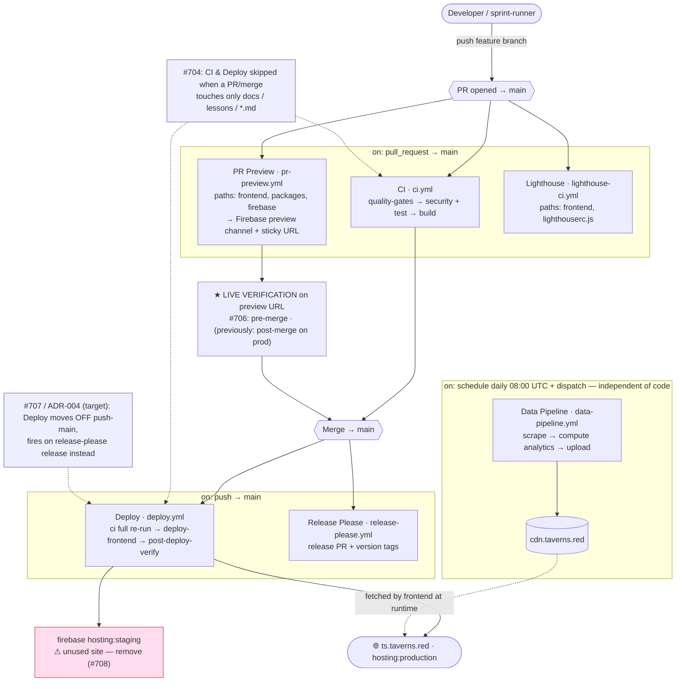

# CI/CD Flow

How code and data move through the GitHub Actions workflows. See `.github/workflows/` for the source.

## Diagram

## Workflows

| Workflow             | Trigger                                 | Does                                                                                                             |
| -------------------- | --------------------------------------- | ---------------------------------------------------------------------------------------------------------------- |
| `ci.yml`             | PR → main/develop; push develop; called | `quality-gates` (tsc/lint/yaml/fmt) → `security` (Trivy) + `test` (full suite) → `build`                         |
| `pr-preview.yml`     | PR (frontend/packages/firebase paths)   | Per-PR Firebase preview channel (staging CDN data) + sticky comment with the URL                                 |
| `lighthouse-ci.yml`  | PR (frontend paths)                     | Perf/a11y budget on the PR                                                                                       |
| `deploy.yml`         | push → main; dispatch                   | Re-runs `ci.yml`, then builds + deploys `hosting:staging` and `hosting:production`, post-deploy CDN health check |
| `release-please.yml` | push → main                             | Maintains the release PR + version tags from conventional commits                                                |
| `data-pipeline.yml`  | schedule (daily) + dispatch             | Scrapes dashboards → computes analytics → uploads snapshots to GCS/CDN (independent of code)                     |

## Key properties

- **CI runs twice per change today:** once on the PR, and again inside `deploy.yml` (via `workflow_call`) on the main merge. ADR-004 collapses the second run to release time.
- **Two live surfaces:** the ephemeral **PR preview** (per-PR, staging CDN data) and **production** (`ts.taverns.red`, prod CDN). Per-sprint verification targets the preview (#706).
- **Code and data are separate pipelines:** the frontend deploy ships the _app_; `data-pipeline.yml` ships the _data_ the app reads from `cdn.taverns.red`. Neither triggers the other.

## In-flight changes

| Issue / PR     | Change                                                                                            |
| -------------- | ------------------------------------------------------------------------------------------------- |
| #703 / PR #704 | Path-ignore docs/lessons in CI + Deploy                                                           |
| #705 / PR #706 | DoD verifies on the PR preview channel, not prod                                                  |
| #708           | Remove the unused `hosting:staging` deploy step                                                   |
| #707 / ADR-004 | Release-gated production deploy (deploy on release-please release; drop per-merge full-CI re-run) |

Tracked under epic #709.
